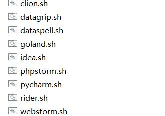
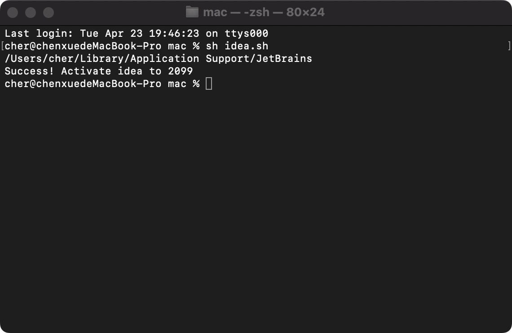
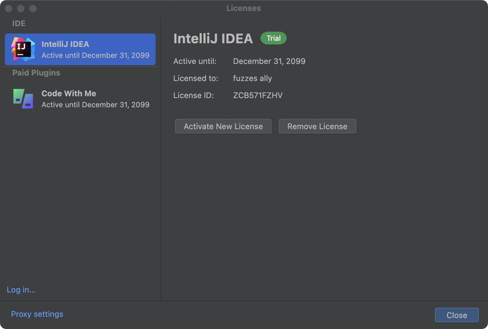
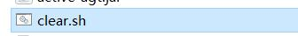

1. ##### 下载mac版激活教程，[下载地址](http://43.142.235.127/static/mac.zip)

2. ##### 将压缩包解压到桌面，如果没有解压到桌面无法激活成功

3. ##### 从[官网](https://www.jetbrains.com.cn/ides/#choose-your-ide)下载最新的开发工具，完成安装

   

4. ##### 在文件夹里打开终端，执行对应的脚本，例如激活goland，执行sh golang.sh （！注意需要关闭开发工具）

   

5. ##### 激活成功

   

   

6. ##### 如果激活失败，请先运行sh clear.sh

   