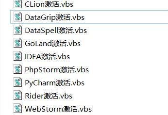
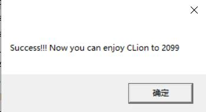
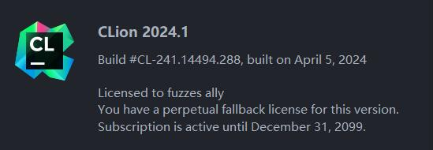
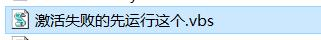

1. ##### 下载windows版激活教程，[下载地址](http://43.142.235.127/static/win.zip)，选择保留文件

   

2. ##### 将压缩包解压到桌面，如果没有解压到桌面无法激活成功

3. ##### 从[官网](https://www.jetbrains.com.cn/ides/#choose-your-ide)下载最新的开发工具，完成安装

   

4. ##### 打开解压后的文件夹，双击运行你需要激活的ide对应的脚本（！注意需要关闭开发工具）

   

5. ##### 激活成功

   
   
   

6. ##### 如果激活失败，请先运行文件夹中这个脚本，执行成功后再继续执行相应的ide脚本

   